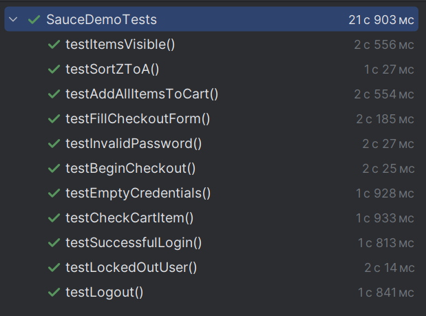

**# TPO2
Результаты тестов

```
Сайт для тестирования - https://www.saucedemo.com/
```
```asciidoc
[INFO] 
[INFO] -------------------------------------------------------
[INFO]  T E S T S
[INFO] -------------------------------------------------------
[INFO] Running SauceDemoTests
июн. 05, 2025 4:25:58 PM org.openqa.selenium.devtools.CdpVersionFinder findNearestMatch
[INFO] Tests run: 11, Failures: 0, Errors: 0, Skipped: 0, Time elapsed: 23.458 s - in SauceDemoTests
[INFO] 
[INFO] Results:
[INFO] 
[INFO] Tests run: 11, Failures: 0, Errors: 0, Skipped: 0
[INFO] 
[INFO] ------------------------------------------------------------------------
[INFO] BUILD SUCCESS
[INFO] ------------------------------------------------------------------------
[INFO] Total time:  31.358 s
[INFO] Finished at: 2025-06-05T16:26:20+03:00
[INFO] ------------------------------------------------------------------------
```


```asciidoc
Проект содержит следующие тесты:
1. testSuccessfulLogin()
Цель: Проверка успешной авторизации

Действия:
Авторизация с валидными данными (standard_user/secret_sauce)
Проверка: URL содержит inventory (значит, авторизация прошла)

2. testInvalidPassword()
Цель: Проверка авторизации с неверным паролем

Действия:
Выход из системы
Попытка входа с неверным паролем (standard_user/wrong_pass)
Проверка: Появление сообщения об ошибке "Username and password do not match"

3. testEmptyCredentials()
Цель: Проверка авторизации без ввода данных

Действия:
Выход из системы
Нажатие кнопки Login без ввода данных
Проверка: Появление сообщения "Username is required"

4. testLockedOutUser()
Цель: Проверка блокировки пользователя

Действия:
Вход под заблокированным пользователем (locked_out_user)
Проверка: Появление сообщения "locked out"

5. testLogout()
Цель: Проверка выхода из системы

6. testItemsVisible()
Цель: Проверка отображения товаров

Действия:
Поиск всех элементов товаров
Проверка: Список товаров не пуст

7. testAddAllItemsToCart()
Цель: Проверка добавления всех товаров в корзину

Действия:
Нажатие всех кнопок "Add to cart"
Проверка счетчика корзины (должен показывать 6)
Очистка корзины (удаление всех товаров)

8. testCheckCartItem()
Цель: Проверка отображения товара в корзине

Действия:
Добавление одного товара
Переход в корзину
Проверка: Название товара отображается в корзине

9. testSortZToA()
Цель: Проверка сортировки товаров (Z → A)

Действия:
Выбор сортировки через dropdown
Получение списка названий товаров
Сравнение с ожидаемым отсортированным списком

10. testBeginCheckout()
Цель: Проверка начала оформления заказа

Действия:
Добавление товара
Переход в корзину
Начало оформления
Проверка: URL содержит checkout-step-one

11. testFillCheckoutForm()
Цель: Проверка заполнения формы оформления

Действия:
Добавление товара → корзина → начало оформления
Заполнение формы (имя, фамилия, почтовый индекс)
Продолжение оформления
Проверка: Переход на следующий шаг (URL содержит checkout-step-two)
```
